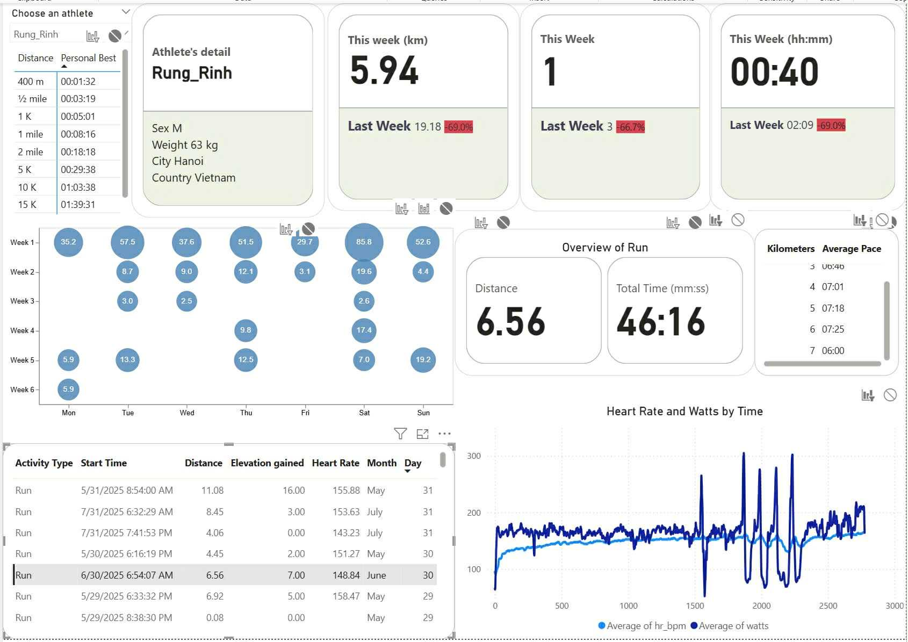
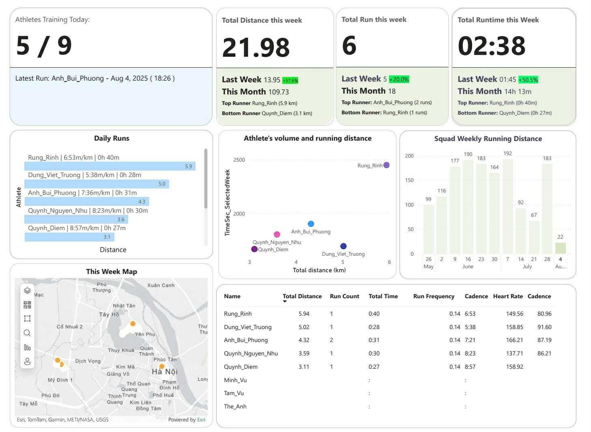

# StravaSquad 🏃‍♀️🏃‍♂️

**StravaSquad** is a multi-runner analytics pipeline and dashboard for Strava data.  
It securely onboards runners via OAuth, ingests activity data (1-second GPS streams, segments, best efforts), enriches and cleans the data, stores it in SQL, and powers squad-level analytics dashboards.


**Current scale:** 10 runners • ~40 activities/week • ~1M GPS points  
**Designed for:** scaling to 100+ runners with incremental ingestion, idempotent upserts, and rate-limit–aware API usage.
**Date:** Data is last updated on October, 2025.

---
**Weekly Squad Heatmap**  
Visualizes training volume and intensity across runners by week, highlighting consistency and spikes in workload.



**Squad Tracker Overview**  
Aggregated squad KPIs (total distance, total time) with drilldowns from squad-level metrics to individual runner activity.



---

## Features
- 🔐 **Secure multi-user onboarding** via Strava OAuth (access/refresh tokens, athlete ID, expiry)
- ⛓️ **Incremental ingestion** of activities, 1s GPS streams, segments, and best efforts
- 🧮 **Data mart transformations**: cadence, distance-based splits, type-safe cleaning
- 🧱 **SQL-backed warehouse** with bulk inserts and deduplication
- 📊 **Power BI dashboards**: weekly heatmaps, squad totals, per-runner volume

---

## Architecture Overview (Pipeline)

```mermaid
flowchart LR
    A[User Consent<br/>Strava OAuth] --> B[OAuth Helper Web App]
    B --> C[strava_profile_crawl.py<br/>Access + Refresh Tokens]
    C --> D[strava_api_downloader.py<br/>Activities & Streams]
    D --> E[datawarehouse.py<br/>Raw Storage]
    E --> F[datamart.py<br/>Clean & Enrich]
    F --> G[datamart_to_sql.py<br/>Bulk Insert]
    G --> H[(Postgres SQL)]
    H --> I[Power BI Dashboards]
