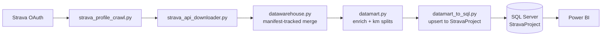
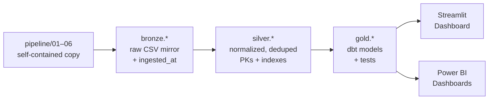

# StravaSquad


**StravaSquad** is a multi-runner analytics pipeline and dashboard for Strava data.
It securely onboards runners via OAuth, ingests 1-second GPS streams, segments, and best
efforts, stores them in a **medallion data warehouse** (bronze / silver / gold), and powers
both a Power BI report and a Streamlit analytics dashboard with race-time prediction.

**Current scale:** 10 runners · ~40 activities/week · ~1 M GPS points  
**Data last updated:** October 2025

---

## Key Features

- **End-to-end ingestion** — OAuth token management, Strava API polling with rate-limit handling, incremental CSV export, idempotent SQL upsert
- **Medallion warehouse** (`StravaDW` on SQL Server) — raw bronze mirror → deduplicated/normalized silver → dbt-managed gold layer with automated testing
- **Race-time prediction** — Riegel, VDOT (Jack Daniels), and elevation-adjusted Riegel formulas, backtested against a real squad Half-Marathon (6 athletes) and Marathon (1 athlete)
- **Streamlit analytics dashboard** — squad weekly view, individual athlete drilldown, training readiness retrospective, and prediction accuracy explorer
- **Power BI dashboards** — squad weekly KPIs and individual athlete drilldowns, re-pointed to `StravaDW.silver.*` from the original flat schema

---

## Architecture

### Ingestion pipeline (original `D:\BO\` scripts → `StravaProject` SQL Server)


```mermaid
flowchart LR
    A[Strava OAuth] --> B[strava_profile_crawl.py]
    B --> C[strava_api_downloader.py]
    C --> D[datawarehouse.py\nmanifest-tracked merge]
    D --> E[datamart.py\nenrich + km splits]
    E --> F[datamart_to_sql.py\nupsert to StravaProject]
    F --> G[(SQL Server\nStravaProject)]
    G --> H[Power BI]
```

### Medallion warehouse (`stravasquad2026/` → `StravaDW` SQL Server)


```mermaid
flowchart LR
    P[pipeline/01–06\nself-contained copy] --> BRZ
    BRZ["bronze.*\nraw CSV mirror\n+ ingested_at"] --> SLV
    SLV["silver.*\nnormalized, deduped\nPKs + indexes"] --> GOLD
    GOLD["gold.*\ndbt models\n+ tests"] --> STR[Streamlit\nDashboard]
    GOLD --> PBI[Power BI\nDashboards]
```

---

## Medallion Architecture (`stravasquad2026/`)

### Bronze layer
Raw mirror of consolidated CSV exports, append-only, with `ingested_at` audit column.
Tables: `RunStream`, `RunBest`, `RunSegment`, `RunSplitKilometer`, `Activities`, `Athlete`.

### Silver layer
Normalized tables with primary keys, indexes, and deduplication on load:
- Drops duplicate/raw columns (`start_index`, `end_index`, `device_watts`, `hidden`, `visibility`, `kom_rank`)
- Dedupes `RunStream` on `(activity_id, time_s)` — the original pipeline had a 24.5% duplicate rate caused by a crash-before-manifest-update bug in `datawarehouse.py` (fixed)
- ~2 M rows in `silver.RunStream` after dedup

DDL: [`stravasquad2026/sql/01_create_stravadw.sql`](stravasquad2026/sql/01_create_stravadw.sql)  
Loader: [`stravasquad2026/pipeline/06_load_to_stravadw.py`](stravasquad2026/pipeline/06_load_to_stravadw.py)

### Gold layer (dbt)
dbt project at [`stravasquad2026/dbt/`](stravasquad2026/dbt/), targeting `StravaDW.gold`.
Run: `$env:DBT_PROFILES_DIR = ".\stravasquad2026\dbt"; dbt run; dbt test`

| Model | Type | Purpose |
|---|---|---|
| `gold.dim_date` | table | Calendar spine — `iso_week`, `week_start_date`, `week_relative_to_today`, `days_ago` |
| `gold.dim_distance_label` | seed | 13 ordered race-distance labels (400m → Marathon) with `sort_order` |
| `gold.gold_activity_start_location` | table | First GPS point per activity (955 of 1,465 with streams) for map pins |
| `gold.PBPrediction` | external (Python) | Per-athlete/distance linear trend projection + r² — written by `predict_pb.py` |
| `gold.RaceForecast` | external (Python) | Race-time backtest results (3 methods × 4 checkpoints × 6 athletes) — written by `predict_pb.py` |

All gold models have `not_null` / `accepted_values` column tests + composite uniqueness tests.
**17/17 dbt tests pass.**

DDL for prediction tables: [`stravasquad2026/sql/02_create_gold_predictions.sql`](stravasquad2026/sql/02_create_gold_predictions.sql)

---

## Race-Time Prediction (`stravasquad2026/predict_pb.py`)

Backtested against two real squad races using three explainable formulas.

### Formulas

| Method | Formula |
|---|---|
| **Riegel** | `T2 = T1 × (D2/D1)^1.06` |
| **VDOT** (Jack Daniels) | Source PB → VO2max cost/%VO2 → VDOT → numerically inverted for target distance via `scipy.optimize.brentq` |
| **Elevation-adjusted Riegel** | Strips a 2 sec/km-per-(m/km) penalty from source pace, Riegel-scales, re-applies target elevation penalty |

Source PB preference: 10K > 15K > 5K > 20K > 10 mile > 1 mile > 30K (HM/Marathon excluded to avoid circular reference).

### Backtest results

**Half-Marathon, 2025-10-26 (6 athletes)**

| Method | Mean absolute error |
|---|---|
| Riegel | 14.6% |
| VDOT | 14.8% |
| Elevation-adjusted Riegel | 14.8% |

Best athlete predictions landed within ±3.5%. Largest miss was due to source-PB quality
(a casual long-run 10K split used instead of a race effort) — documented root-cause analysis
in [`PREDICTION_REPORT.md`](stravasquad2026/PREDICTION_REPORT.md).

**Marathon, 2025-10-05 (Tam Vu)**  
VDOT predicted marathon time within **0.5%** using an 8-week-old 10K PB.

### Prediction accuracy improvements (recommended, not yet implemented)
1. Filter source PBs to activities where total distance is within ±20% of the PB distance (removes mid-run splits)
2. Use **fastest** 10K in 90-day window instead of most recent
3. Blend formula with trend-regression projection for athletes where r² ≥ 0.5

---

## Streamlit Dashboard (`stravasquad2026/dashboard/`)

Run: `& "path\to\python.exe" -m streamlit run stravasquad2026\dashboard\app.py`

Three tabs:

### Tab 1 — Dashboard
**Weekly (Squad):** PBI-style KPI cards (week-over-week distance/runs/runtime with % badges,
top/bottom runner), horizontal bar chart of today's runs, full-week GPS stream map from
`silver.RunStream`, last-4-weeks squad bar chart, per-runner weekly stats table (run days,
avg cadence, avg HR, distance, runtime).

**Individual:** Athlete detail card + 3 weekly KPI cards in a CSS grid row, Strava-style
activity history chart (weekly/monthly × distance/time/elevation), 4-week bubble chart,
Personal Bests table, run map + km-splits table + HR/Watts chart all synced to a single
shared activity selector.

### Tab 2 — Prediction
HM backtest error table + method comparison bar, marathon bonus case, PB trend line charts
per athlete/distance, and a Training Readiness retrospective scoped to the 16-week block
before the squad's Half-Marathon — weekly distance, long run progression (18 km threshold),
ramp rate with safe-zone bands, and run count, all with taper zone and race-day markers.

### Tab 3 — AI Training
Placeholder for adaptive training plan generation.

---

## Self-contained Pipeline (`stravasquad2026/pipeline/`)

A clean, numbered copy of the full 6-stage ingestion chain targeting `StravaDW` only
(the original `D:\BO\*.py` scripts continue to feed `StravaProject` for Power BI):

```
01_download_streams.py    → fetch streams, segments, best efforts, GPX
02_export_activities.py   → normalize 90-day activity summaries
03_profile_crawl.py       → fetch athlete profiles
04_datawarehouse.py       → manifest-tracked merge into data/strava_api_exports/
05_datamart.py            → enrich + km segmentation (incremental by activity_id)
06_load_to_stravadw.py    → upsert into StravaDW bronze + silver
```

Each stage is idempotent — re-running skips already-processed data.

---

## Tech Stack

| Tool | Role |
|---|---|
| Python (pandas, SQLAlchemy, pyodbc, requests, numpy, scipy) | Ingestion, transformation, prediction |
| SQL Server (local `HANG` instance, ODBC Driver 17) | `StravaProject` (legacy) + `StravaDW` (medallion) |
| dbt-sqlserver 1.10 | Gold layer models, seeds, automated tests |
| Streamlit + Plotly | Analytics dashboard |
| Power BI | Squad + individual dashboards (Import mode, `silver.*`) |
| Strava API (OAuth 2.0) | Data source |

---

## Dashboard Screenshots

**Weekly Squad View**


**Individual Athlete View**

