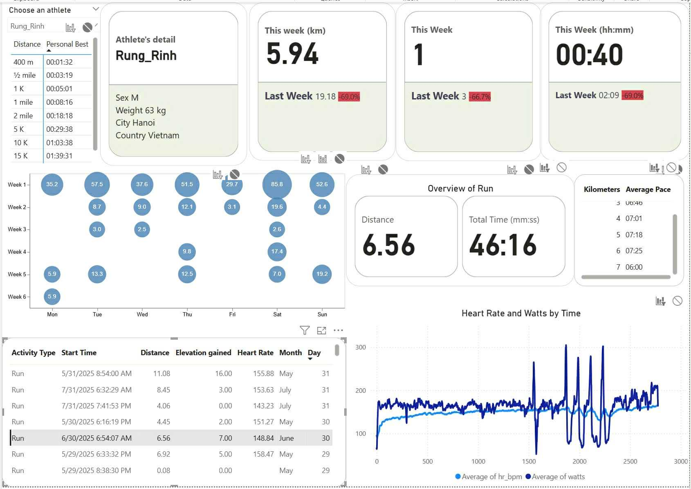
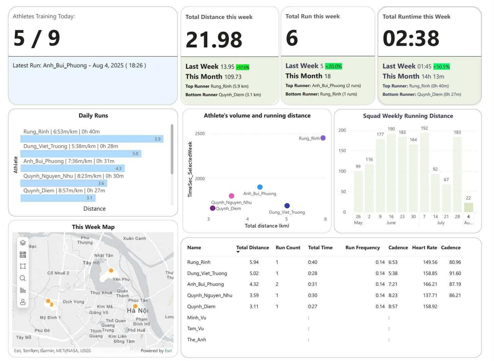

# StravaSquad 🏃‍♀️🏃‍♂️

**StravaSquad** is a multi-runner analytics pipeline and dashboard for Strava data.  
It securely onboards runners via OAuth, ingests activity data (1-second GPS streams, segments, best efforts), enriches and cleans the data, stores it in SQL, and powers squad-level analytics dashboards.


**Current scale:** 10 runners • ~40 activities/week • ~1M GPS points  
**Designed for:** scaling to 100+ runners with incremental ingestion, idempotent upserts, and rate-limit–aware API usage.
**Date:** Data is last updated on October, 2025.

**ETL Workflow **
[ETL Workflow](dashboard/worflow.png)

---
**Weekly Squad Heatmap**  
Visualizes training volume and intensity across runners by week, highlighting consistency and spikes in workload.



**Squad Tracker Overview**  
Aggregated squad KPIs (total distance, total time) with drilldowns from squad-level metrics to individual runner activity.



---
Individual Dashboard
Designed for athlete-level performance review:
    -Session bubble chart (last 30 days) to spot training patterns and volume
    -Personal-best segments (e.g., 400m, 1K, 1 mile, 5K, etc.)
    -Per-run overview: distance, total time, pace-by-kilometer breakdown
    -Time series: heart rate + watts by time to inspect effort and pacing stability

Squad / Weekly Dashboard
Designed for team performance monitoring:

    -Athletes training today + latest run feed (quick daily visibility)
    -Weekly KPIs: total distance / total runtime / run count with week-over-week deltas
    -Scatterplot: athlete volume vs running distance
    -Squad weekly distance trend for consistency / spikes
    -Weekly route map overview for spatial context

---

## Architecture Overview (Pipeline)

```mermaid
flowchart LR
    A[User Consent<br/>Strava OAuth] --> B[OAuth Helper Web App]
    B --> C[strava_profile_crawl.py<br/>Access + Refresh Tokens]
    C --> D[strava_api_downloader.py<br/>Activities & Streams]
    D --> E[datawarehouse.py<br/>Raw Storage]
    E --> F[datamart.py<br/>Clean & Enrich]
    F --> G[datamart_to_sql.py<br/>Bulk Insert]
    G --> H[(Postgres SQL)]
    H --> I[Power BI Dashboards]
